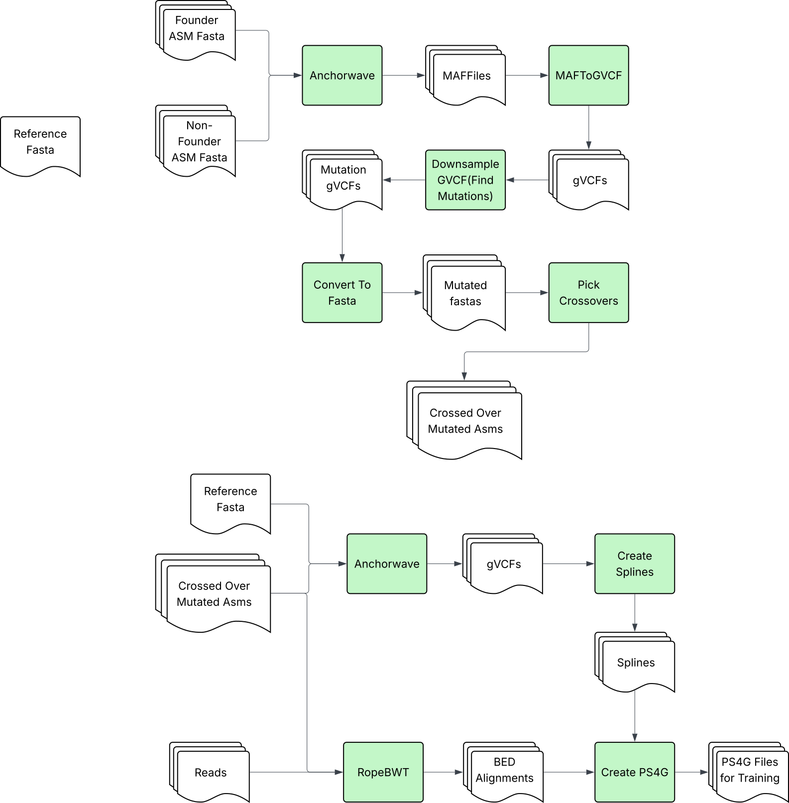

# v1 Pipeline

The **v1** pipeline is the default pipeline (used when the YAML `version` field is
omitted or set to `"v1"`). It is a 15-step workflow that aligns assemblies,
simulates variants and recombinant genomes at the FASTA level, and produces PS4G
files for genotype imputation.

For the per-command option reference (every flag, output, and example), see
[`commands.md`](commands.md). For the full annotated configuration schema, see
[`pipeline_config.example.yaml`](../pipeline_config.example.yaml).

<p align="center">
  
</p>

## Pipeline Overview

The pipeline consists of three sequential workflows. `setup-environment` (step 00)
runs automatically on first use of `orchestrate`.

### Variant Pipeline (Steps 01-04)

Generate variants from query assemblies.

| Step | Command | Description |
|------|---------|-------------|
| 00 | **setup-environment** | Initialize pixi environment and download tools (auto-runs with orchestrate) |
| 01 | **align-assemblies** | Align query assemblies to reference using AnchorWave and minimap2 |
| 02 | **maf-to-gvcf** | Convert MAF alignments to compressed GVCF format |
| 03 | **downsample-gvcf** | Downsample variants at specified rates per chromosome |
| 04 | **convert-to-fasta** | Generate mutated FASTA files from downsampled variants |

### Recombination Pipeline (Steps 05-09)

Generate recombinant genomes by simulating crossovers and concatenating parent segments.

| Step | Command | Description |
|------|---------|-------------|
| 05 | **pick-crossovers** | Simulate crossover events and create ancestry tracking BED files |
| 06 | **create-chain-files** | Convert MAF alignments to CHAIN format for coordinate conversion |
| 07 | **convert-coordinates** | Convert reference coordinates to assembly coordinates via chain files |
| 08 | **generate-recombined-sequences** | Concatenate parent segments into recombined FASTA sequences |
| 09 | **format-recombined-fastas** | Normalize recombined FASTA line widths via seqkit |

### PS4G Creation (Steps 10-15)

Create the PHGv2 ropebwt3 index and convert RopeBWT3 alignments into PS4G format
for genotype imputation.

| Step | Command | Description |
|------|---------|-------------|
| 10 | **align-mutated-assemblies** | Realign formatted recombined sequences back to the reference |
| 11 | **maf-to-gvcf** *(as `mutated_maf_to_gvcf`)* | Convert mutated MAF alignments to GVCF (orchestrate-only step; reuses `maf-to-gvcf`) |
| 12 | **rope-bwt-chr-index** | Build a PHGv2 ropebwt3 index from recombined FASTA files |
| 13 | **ropebwt-mem** | Align FASTQ reads to the ropebwt3 index and emit BED alignments |
| 14 | **build-spline-knots** | Build spline knots from hVCF/gVCF files for imputation |
| 15 | **convert-ropebwt2ps4g** | Convert RopeBWT3 BED alignments to PS4G format |

### Helper Commands

Standalone utilities that are not part of the sequential pipeline.

| Command | Description |
|---------|-------------|
| **extract-chrom-ids** | Extract unique chromosome IDs from GVCF files |
| **mutate-assemblies** | Inject variants from a donor GVCF into a base GVCF |
| **recombine-gvcfs** | Construct recombined GVCFs from per-sample BED ancestry maps |

Each command generates logs in `<work-dir>/logs/` and outputs in `<work-dir>/output/`.

## One-Command Pipeline Execution (Recommended)

```bash
# 1. Install seq_sim (see the README) and make sure it's on your PATH

# 2. Create your pipeline configuration
cp pipeline_config.example.yaml my_pipeline.yaml
# Edit my_pipeline.yaml with your file paths

# 3. Run the entire pipeline (automatic environment setup!)
seq_sim orchestrate --config my_pipeline.yaml
```

The orchestrate command automatically:
- Detects if environment setup is needed
- Downloads and installs required tools
- Runs all configured pipeline steps in sequence
- Tracks outputs between steps

## Manual Step-by-Step Execution

The full pipeline is 15 sequential steps grouped into three workflows. Each step
can also be run standalone via its own clikt subcommand:

```bash
# 0. Install seq_sim (see the README) and make sure it's on your PATH.
#    Setup is automatic with orchestrate; invoke manually if running steps standalone:
seq_sim setup-environment

# --- Variant pipeline (generate variants) -----------------------------------
# 01. Align query assemblies to the reference
seq_sim align-assemblies --ref-gff ref.gff --ref-fasta ref.fa --query-fasta queries/

# 02. Convert MAF alignments to compressed GVCF
seq_sim maf-to-gvcf --reference-file ref.fa \
    --maf-file seq_sim_work/output/01_anchorwave_results/maf_file_paths.txt

# 03. Downsample variants at specified rates per chromosome
seq_sim downsample-gvcf --gvcf-dir seq_sim_work/output/02_gvcf_results/

# 04. Generate mutated FASTA files from the downsampled variants
seq_sim convert-to-fasta --ref-fasta ref.fa \
    --gvcf-file seq_sim_work/output/03_downsample_results/

# --- Recombination pipeline (generate recombinant genomes) ------------------
# 05. Pick crossover breakpoints in reference coordinates
seq_sim pick-crossovers --ref-fasta ref.fa --assembly-list assembly_list.txt

# 06. Convert MAF alignments to UCSC chain format for coordinate conversion
seq_sim create-chain-files \
    --maf-input seq_sim_work/output/01_anchorwave_results/maf_file_paths.txt --jobs 8

# 07. Convert reference-coordinate crossover points to assembly coordinates
seq_sim convert-coordinates --assembly-list assembly_list.txt \
    --chain-dir seq_sim_work/output/06_chain_results/

# 08. Generate recombined FASTA sequences by concatenating parent segments
seq_sim generate-recombined-sequences --assembly-list assembly_list.txt \
    --chromosome-list chromosomes.txt --assembly-dir data/assemblies/

# 09. Format recombined FASTA files to consistent line widths
seq_sim format-recombined-fastas \
    --fasta-input seq_sim_work/output/08_recombined_sequences/recombinate_fastas/

# --- PS4G creation (PHG indexing for genotype imputation) -------------------
# 10. Realign the formatted recombined sequences back to the reference
seq_sim align-mutated-assemblies --ref-gff ref.gff --ref-fasta ref.fa \
    --fasta-input seq_sim_work/output/09_formatted_fastas/

# 11. Convert mutated MAF alignments to GVCF (reuses maf-to-gvcf)
seq_sim maf-to-gvcf --reference-file ref.fa \
    --maf-file seq_sim_work/output/10_mutated_alignment_results/maf_file_paths.txt \
    --output-dir seq_sim_work/output/11_mutated_gvcf_results/

# 12. Build a PHGv2 ropebwt3 index from the recombined FASTAs
seq_sim rope-bwt-chr-index --fasta-input seq_sim_work/output/09_formatted_fastas/ \
    --threads 20

# 13. Align FASTQ reads to the ropebwt3 index
seq_sim ropebwt-mem --fastq-input samples/ --threads 40

# 14. Build spline knots from hVCF/gVCF files (independent step)
seq_sim build-spline-knots --vcf-dir vcf_files/ --vcf-type gvcf

# 15. Convert RopeBWT3 BED alignments to PS4G format
seq_sim convert-ropebwt2ps4g \
    --bed-input seq_sim_work/output/12_ropebwt_mem_results/ \
    --spline-knot-dir seq_sim_work/output/13_spline_knots_results/
```

## Complete Workflow Examples

The three workflows below map to the three sections of
[`pipeline_config.example.yaml`](../pipeline_config.example.yaml) and can be run
either as a single `orchestrate` invocation or as standalone clikt commands.

### Variant Pipeline (Steps 01-04)

#### Option 1: Using Orchestrate (Recommended)

```bash
# 1. Install seq_sim (see the README) and make sure it's on your PATH

# 2. Create configuration
cat > variant.yaml <<EOF
work_dir: "my_analysis"

run_steps:
  - align_assemblies
  - maf_to_gvcf
  - downsample_gvcf
  - convert_to_fasta

align_assemblies:
  ref_gff: "reference.gff"
  ref_fasta: "reference.fa"
  query_fasta: "queries/"
  threads: 8

maf_to_gvcf:
  sample_name: "sample1"

downsample_gvcf:
  rates: "0.1,0.2,0.3"
  seed: 42

convert_to_fasta:
  missing_records_as: "asRef"
EOF

# 3. Run the entire variant pipeline (automatic setup!)
seq_sim orchestrate --config variant.yaml
```

#### Option 2: Manual Execution

```bash
# 1. Install seq_sim (see the README) and make sure it's on your PATH

# 2. One-time environment setup
seq_sim setup-environment -w my_work

# 3. Run steps 01-04 (see commands.md for more examples)
seq_sim align-assemblies -g ref.gff -r ref.fa -q queries/ -t 8 -w my_work
seq_sim maf-to-gvcf -r ref.fa \
    -m my_work/output/01_anchorwave_results/maf_file_paths.txt -w my_work
seq_sim downsample-gvcf -g my_work/output/02_gvcf_results/ \
    --rates 0.1,0.2,0.3 --seed 42 -w my_work
seq_sim convert-to-fasta -r ref.fa \
    -g my_work/output/03_downsample_results/ -w my_work
```

---

### Recombination Pipeline (Steps 01, 05-09)

Generates recombined sequences by simulating crossover events and combining
segments from multiple parent assemblies. Requires `align-assemblies` (step 01)
to produce MAF files that feed into step 06.

#### Using Orchestrate (Recommended)

```bash
# 1. Install seq_sim (see the README) and make sure it's on your PATH

# 2. Prepare input files
#    - assembly_list.txt (tab-separated: /path/to/assembly.fa<TAB>name; EVEN number of rows)
#    - chromosomes.txt (one chromosome name per line; optional)

# 3. Create recombination configuration
cat > recombination.yaml <<EOF
work_dir: "recomb_analysis"

run_steps:
  - align_assemblies
  - pick_crossovers
  - create_chain_files
  - convert_coordinates
  - generate_recombined_sequences
  - format_recombined_fastas

align_assemblies:
  ref_gff: "data/reference.gff"
  ref_fasta: "data/reference.fa"
  query_fasta: "data/assemblies.txt"
  threads: 8

pick_crossovers:
  assembly_list: "data/assembly_list.txt"

create_chain_files:
  jobs: 12

convert_coordinates:
  assembly_list: "data/assembly_list.txt"

generate_recombined_sequences:
  assembly_list: "data/assembly_list.txt"
  chromosome_list: "data/chromosomes.txt"
  assembly_dir: "data/assemblies/"

format_recombined_fastas:
  line_width: 60
  threads: 8
EOF

# 4. Run the recombination pipeline
seq_sim orchestrate --config recombination.yaml
```

#### Manual Execution

```bash
# 1. Install seq_sim and run setup-environment (see above)

# 2. Align parent assemblies to reference (step 01)
seq_sim align-assemblies -g ref.gff -r ref.fa -q assemblies.txt -t 8

# 3. Pick crossover points (step 05)
seq_sim pick-crossovers -r ref.fa -a assembly_list.txt

# 4. Create chain files from MAF alignments (step 06)
seq_sim create-chain-files \
    -m seq_sim_work/output/01_anchorwave_results/maf_file_paths.txt -j 12

# 5. Convert reference coordinates to assembly coordinates (step 07)
seq_sim convert-coordinates -a assembly_list.txt \
    -c seq_sim_work/output/06_chain_results/

# 6. Generate recombined sequences (step 08)
seq_sim generate-recombined-sequences \
    -a assembly_list.txt -c chromosomes.txt -d data/assemblies/

# 7. Format recombined FASTAs (step 09)
seq_sim format-recombined-fastas \
    -f seq_sim_work/output/08_recombined_sequences/recombinate_fastas/ -l 60 -t 8
```

---

### PS4G Creation (Steps 10-15)

Builds a PHGv2 ropebwt3 index from the recombined sequences and converts
RopeBWT3 alignments into PS4G files for genotype imputation.

#### Using Orchestrate (Recommended)

```bash
# 1. Install seq_sim (see the README) and make sure it's on your PATH

# 2. Build on the output of the Recombination Pipeline above; append these to the YAML:
cat >> recombination.yaml <<EOF

run_steps:
  - align_mutated_assemblies
  - mutated_maf_to_gvcf
  - rope_bwt_chr_index
  - ropebwt_mem
  - build_spline_knots
  - convert_ropebwt2ps4g

align_mutated_assemblies:
  threads: 8

mutated_maf_to_gvcf: {}

rope_bwt_chr_index:
  index_file_prefix: "phgIndex"
  threads: 20
  delete_fmr_index: true

ropebwt_mem:
  fastq_input: "data/fastq_samples/"
  threads: 40

build_spline_knots:
  vcf_dir: "seq_sim_work/output/11_mutated_gvcf_results/"
  vcf_type: "gvcf"

convert_ropebwt2ps4g:
  min_mem_length: 135
  max_num_hits: 16
EOF

# 3. Run the PS4G creation steps
seq_sim orchestrate --config recombination.yaml
```

#### Manual Execution

```bash
# Assumes steps 01-09 already produced 09_formatted_fastas/ and step 10 has ref files

# 1. Realign recombined sequences to the reference (step 10)
seq_sim align-mutated-assemblies -g ref.gff -r ref.fa \
    -f seq_sim_work/output/09_formatted_fastas/ -t 8

# 2. Convert the mutated MAFs to GVCFs (step 11; reuses maf-to-gvcf)
seq_sim maf-to-gvcf -r ref.fa \
    -m seq_sim_work/output/10_mutated_alignment_results/maf_file_paths.txt \
    --output-dir seq_sim_work/output/11_mutated_gvcf_results/

# 3. Build the ropebwt3 index (step 12)
seq_sim rope-bwt-chr-index \
    -f seq_sim_work/output/09_formatted_fastas/ -t 20

# 4. Align FASTQ reads to the index (step 13)
seq_sim ropebwt-mem -f data/fastq_samples/ -t 40

# 5. Build spline knots from the step 11 GVCFs (step 14)
seq_sim build-spline-knots \
    -v seq_sim_work/output/11_mutated_gvcf_results/ -t gvcf

# 6. Convert BED alignments to PS4G (step 15)
seq_sim convert-ropebwt2ps4g
```

---

## Working Directory Structure

By default every command writes into `seq_sim_work/` (override with
`--work-dir` or the YAML `work_dir`). The full layout after running all 15
steps looks like:

```text
<work-dir>/
├── pixi.toml                          # Installed by setup-environment
├── .pixi/                             # Pixi-managed conda environment
├── src/
│   ├── MLImpute/                      # Downsampling + ConvertToFasta sources
│   ├── biokotlin-tools/               # maf-to-gvcf conversion tool
│   └── phg_v2/                        # PHGv2 (used by ropebwt / spline steps)
├── logs/
│   ├── 00_setup_environment.log
│   ├── 01_align_assemblies.log
│   ├── 02_maf_to_gvcf.log
│   ├── 03_downsample_gvcf.log
│   ├── 04_convert_to_fasta.log
│   ├── 05_pick_crossovers.log
│   ├── 06_create_chain_files.log
│   ├── 07_convert_coordinates.log
│   ├── 08_generate_recombined_sequences.log
│   ├── 09_format_recombined_fastas.log
│   ├── 10_align_mutated_assemblies.log
│   ├── 11_mutated_maf_to_gvcf.log     # From the orchestrate-only step
│   ├── 12_rope_bwt_chr_index.log
│   ├── 12_ropebwt_mem.log             # Step 13 (dir prefix 12)
│   ├── 13_build_spline_knots.log      # Step 14 (dir prefix 13)
│   └── 14_convert_ropebwt2ps4g.log    # Step 15 (dir prefix 14)
└── output/
    ├── 01_anchorwave_results/         # Step 01: MAFs, SAMs, anchors, cds.fa
    ├── 02_gvcf_results/               # Step 02: *.g.vcf.gz + gvcf_file_paths.txt
    ├── 03_downsample_results/         # Step 03: *_subsampled.gvcf (+ block sizes)
    ├── 04_fasta_results/              # Step 04: mutated FASTAs + fasta_file_paths.txt
    ├── 05_crossovers_results/         # Step 05: {founder}_refkey.bed
    ├── 06_chain_results/              # Step 06: *.chain + chain_file_paths.txt
    ├── 07_coordinates_results/        # Step 07: {assembly}_key.bed, {founder}_key.bed
    ├── 08_recombined_sequences/       # Step 08: recombinate_fastas/{founder}.fa
    ├── 09_formatted_fastas/           # Step 09: line-wrapped recombined FASTAs
    ├── 10_mutated_alignment_results/  # Step 10: realigned MAFs + maf_file_paths.txt
    ├── 11_mutated_gvcf_results/       # Step 11: mutated GVCFs (orchestrate-only step)
    ├── 12_rope_bwt_index_results/     # Step 12: phgIndex.fmd + phg_keyfile.txt
    ├── 12_ropebwt_mem_results/        # Step 13: {sample}_ropebwt.bed
    ├── 13_spline_knots_results/       # Step 14: spline knot files
    └── 14_convert_ropebwt2ps4g_results/ # Step 15: {sample}.ps4g + ps4g_file_paths.txt
```

> **Note:** The directory-name numeric prefixes above are inherited from older
> naming and do **not** always match the current pipeline step number (for
> example, step 13 `ropebwt-mem` writes to `12_ropebwt_mem_results/`). The
> pipeline step numbers in this document are the canonical ordering.
