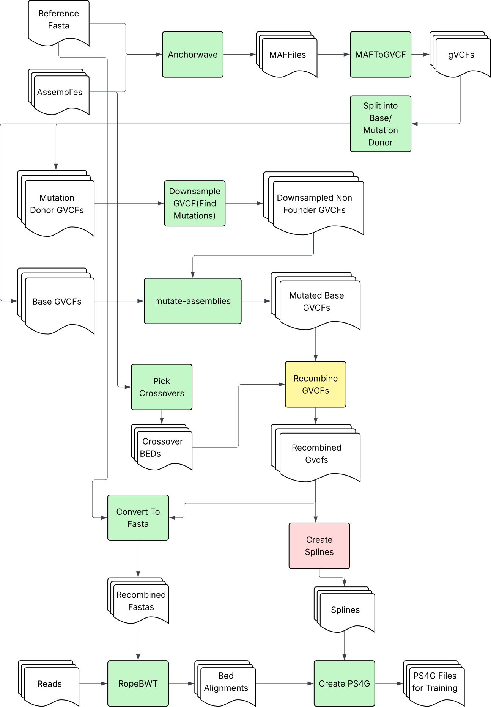

# v2 Pipeline

The **v2** pipeline is selected by setting `version: "v2"` in the YAML config. It
is a 12-step workflow that performs recombination at the **gVCF level** rather
than the FASTA level: variants from a downsampled "mutation donor" gVCF are mixed
into a "base" gVCF, the mutated base gVCFs are recombined along simulated
crossover breakpoints, and the result is converted back to FASTA and turned into
PS4G files for genotype imputation.

For the per-command option reference (every flag, output, and example), see
[`commands.md`](commands.md). For the full annotated configuration schema, see
[`pipeline_config_v2.example.yaml`](../pipeline_config_v2.example.yaml).

<p align="center">
  
</p>

## Pipeline Overview

The v2 pipeline produces recombined gVCFs (and downstream PS4G files) by mixing
variants from a downsampled mutation-donor gVCF into a base gVCF. A required
keyfile defines which samples are bases, which are mutation donors, and how they
are paired. `setup-environment` (step 00) runs automatically on first use of
`orchestrate`.

| Step | Command | Description |
|------|---------|-------------|
| 01 | **align-assemblies** | Align query assemblies to reference using AnchorWave and minimap2 |
| 02 | **maf-to-gvcf** | Convert MAF alignment files to compressed GVCF format |
| 03 | **split-gvcfs** | Split gVCFs into base / mutation-donor sets (keyfile-driven) |
| 04 | **downsample-gvcf** | Downsample the mutation-donor gVCFs at the given rates |
| 05 | **mutate-assemblies** | Mutate each base gVCF with its downsampled mutation donor(s) → mutated base gVCFs |
| 06 | **pick-base-crossovers** | Pick crossover breakpoints on the base assemblies |
| 07 | **recombine-gvcfs** | Recombine the mutated base gVCFs along the crossover BEDs → recombined gVCFs |
| 08 | **sort-gvcfs** | Sort the recombined gVCFs with bcftools → bgzip-compressed, indexed gVCFs |
| 09 | **convert-to-fasta** | Convert the sorted gVCFs back to FASTA using the reference FASTA |
| 10 | **build-spline-knots** | Build spline knots from the sorted gVCFs for PHGv2 imputation |
| 11 | **ropebwt** | Build a ropebwt3 index from the recombined FASTAs and align FASTQ reads to it |
| 12 | **convert-ropebwt2ps4g** | Convert the ropebwt BED alignments into PS4G files using the spline knots |

> **Note:** Step 11 (`ropebwt`) is a combined step that runs
> [`rope-bwt-chr-index`](commands.md#rope-bwt-chr-index-step-12) (index build)
> followed by [`ropebwt-mem`](commands.md#ropebwt-mem-step-13) (read alignment)
> back to back, writing the index into the `index/` subdirectory of
> `11_ropebwt_results/`.

## Using Orchestrate (Recommended)

```bash
# 1. Install seq_sim (see the README) and make sure it's on your PATH

# 2. Create your v2 pipeline configuration
cp pipeline_config_v2.example.yaml my_pipeline_v2.yaml
# Edit my_pipeline_v2.yaml with your file paths and split keyfile

# 3. Run the entire v2 pipeline (automatic environment setup!)
seq_sim orchestrate --config my_pipeline_v2.yaml
```

The orchestrate command automatically:
- Detects if environment setup is needed and runs `setup-environment`
- Reads the `version: "v2"` field and dispatches to the v2 pipeline
- Runs all configured steps in sequence, chaining outputs between them

A minimal v2 configuration looks like:

```yaml
version: "v2"
work_dir: "seq_sim_work"

run_steps:
  - align_assemblies     # Step 01: Align original assemblies
  - maf_to_gvcf          # Step 02: Convert alignments to GVCF
  - split_gvcfs          # Step 03: Split into base / mutation-donor gVCFs
  - downsample_gvcf      # Step 04: Downsample the mutation-donor gVCFs
  - mutate_assemblies    # Step 05: Produce mutated base gVCFs
  - pick_crossovers      # Step 06: Pick crossovers on the base assemblies
  - recombine_gvcfs      # Step 07: Recombine mutated base gVCFs along crossovers
  - sort_gvcfs           # Step 08: Sort recombined gVCFs with bcftools
  - convert_to_fasta     # Step 09: Convert sorted gVCFs back to FASTA
  - build_spline_knots   # Step 10: Build spline knots from sorted gVCFs
  - ropebwt              # Step 11: Index recombined FASTAs and align FASTQ reads
  - convert_ropebwt2ps4g # Step 12: Convert ropebwt BED alignments to PS4G files

align_assemblies:
  ref_gff: "path/to/reference.gff"
  ref_fasta: "path/to/reference.fa"
  query_fasta: "path/to/queries.txt"
  threads: 8

split_gvcfs:
  keyfile: "path/to/split_keyfile.txt"

ropebwt:
  fastq_input: "path/to/reads/"

# ... each step's options mirror its standalone CLI options;
# see pipeline_config_v2.example.yaml for the full schema.
```

## Split Keyfile Format

The `split_gvcfs` (step 03) and `mutate_assemblies` (step 05) steps are driven by
a tab-delimited keyfile that pairs base samples with mutation-donor samples:

- Tab-delimited with a header row containing `Base` and `MutationDonor`.
- Values are sample names matching the step-02 gVCF base names
  (file `{sample}.g.vcf.gz` → sample name).
- A row is "full" only when **both** columns are non-empty **and** both samples
  resolve to a gVCF; non-full / unresolved rows are logged and excluded.
- A base may appear in multiple rows (paired with different donors).

```text
Base	MutationDonor
B73	Mo17
B73	W22
Ki3	Mo17
```

## Step Dependencies and Chaining

Each step consumes the output of an earlier step automatically (override with the
per-step `input`/`output` fields):

- **Step 03 (split-gvcfs)** reads the step-02 gVCFs and the keyfile; writes
  `base/`, `mutation_donor/`, and a normalized `pairs.tsv`.
- **Step 04 (downsample-gvcf)** downsamples the `mutation_donor/` gVCFs from step 03.
- **Step 05 (mutate-assemblies)** mutates each base gVCF with every downsampled
  variant of its mutation donor, producing one mutated base gVCF per pairing
  (`{base}__{donorVariant}_mutated.g.vcf`).
- **Step 06 (pick-base-crossovers)** picks crossovers on the **base** assemblies.
  The base samples from step 03 are mapped to their assembly FASTA counterparts from
  the step-01 query input (matched by base name, e.g. `B73` → `B73.fa`). A base
  without a matching assembly FASTA is a hard error, and the matched assembly
  count must be even (assemblies are paired for crossover simulation).
- **Step 07 (recombine-gvcfs)** stitches the mutated base gVCFs together along the
  crossover BEDs. A mutated gVCF named `{base}__{donor}_mutated.g.vcf` is matched
  to its `{base}_refkey.bed` by base sample name. If a base has multiple mutated
  donors, their variants merge into the same per-target recombinant output.
- **Step 08 (sort-gvcfs)** sorts the recombined gVCFs into coordinate order with
  `bcftools sort` and indexes them.
- **Step 09 (convert-to-fasta)** converts the sorted gVCFs back to FASTA.
- **Step 10 (build-spline-knots)** builds spline knots from the sorted gVCFs.
- **Step 11 (ropebwt)** builds the ropebwt3 index from the step-09 FASTAs and
  aligns the user-provided FASTQ reads to it.
- **Step 12 (convert-ropebwt2ps4g)** converts the step-11 BED alignments to PS4G
  using the step-10 spline knots.

## Working Directory Structure

By default every command writes into `seq_sim_work/` (override with `--work-dir`
or the YAML `work_dir`). The v2 output layout under `<work-dir>/output/` is:

```text
<work-dir>/output/
├── 02_gvcf_results/                  # gVCFs from maf-to-gvcf
├── 03_split_gvcfs_results/           # base/ + mutation_donor/ + pairs.tsv
├── 04_downsample_results/            # downsampled mutation-donor gVCFs
├── 05_mutate_assemblies_results/     # mutated base gVCFs + mutated_gvcf_file_paths.txt
├── 06_crossovers_results/            # base_assembly_list.txt + {assembly}_refkey.bed
├── 07_recombine_gvcfs_results/       # {target}-recombined.gvcf
├── 08_sort_gvcfs_results/            # {target}-recombined.g.vcf.gz (+ .csi) + sorted_gvcf_paths.txt
├── 09_convert_to_fasta_results/      # {sample}.fasta + fasta_file_paths.txt
├── 10_build_spline_knots_results/    # spline knot files for PHGv2 imputation
├── 11_ropebwt_results/               # index/ (.fmd + phg_keyfile.txt) + {sample}_ropebwt.bed + bed_file_paths.txt
└── 12_convert_ropebwt2ps4g_results/  # {sample}.ps4g + ps4g_file_paths.txt
```
